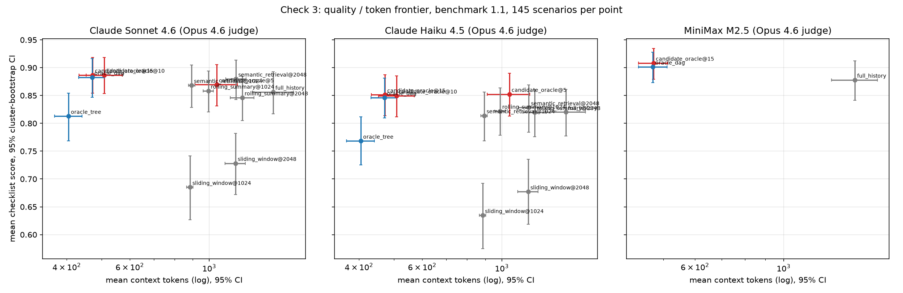

# Check 3 — Retrieval/Compression Comparability: Results

Run date: 2026-09-15  
Frozen thresholds: `f05-candidate-realism/manifest.yaml` → `check3`, committed at d4204fb before any computation; this doc generated at d4204fb  
Benchmark 1.1, 145 scenarios. Primary judge: Claude Opus 4.6 verdicts already on disk (F0 + F0.5; zero new Opus calls). Replication judge: Llama 4 Maverick. Primary response models: Sonnet 4.6, Haiku 4.5; MiniMax M2.5 secondary.

**Decision (primary judge, frozen criterion): Claude Sonnet 4.6: PASS (structured context retains a distinct advantage); Claude Haiku 4.5: PASS (structured context retains a distinct advantage).** Replication judge: Claude Sonnet 4.6: INDETERMINATE; Claude Haiku 4.5: PASS (structured context retains a distinct advantage).

## 0. Integrity disclosure (verbatim from the handoff)

This analysis is **confirmatory-with-disclosure, not blind pre-registration**, and must be described that way in any writeup.

One point estimate is already known. Deriving it from the enlarged-sample contrasts in `JUDGE_RECALIBRATION_RESULTS.md`, pooled over Sonnet and Haiku on benchmark 1.1:

| method | checklist | context tokens |
|---|---|---|
| full_history | 0.838 | 1,508 |
| semantic_retrieval@1024 | 0.841 (derived) | ~900–1,080 |
| oracle_dag | 0.865 | 471 |
| candidate_oracle@15 | 0.869 | 472 |

so `candidate_oracle@15 − semantic_retrieval@1024 ≈ +0.028` pooled. That number was computed before this handoff was written and cannot be un-seen.

**What remains genuinely blind, and is the substance of this pass:** all confidence intervals; the per-family breakdown; `@2048` configurations; both `rolling_summary` budgets; the second-judge replication; the MiniMax arm; and the token-side comparison. Freeze §1's thresholds before computing any of those. Do not adjust them afterwards. Record in the results doc which quantities were known in advance (the one above) and which were not.

Known in advance: the pooled `candidate_oracle@15 − semantic_retrieval@1024` point estimate (+0.028). Not known in advance and computed only after the thresholds were committed: every confidence interval, every p-value, the @2048 and rolling_summary comparisons, per-family results, the Llama replication, the MiniMax arm, and the token comparisons.

## 1. Frozen criterion

- Reference: `candidate_oracle@15`; confirmatory baselines: `semantic_retrieval@1024`, `semantic_retrieval@2048`, `rolling_summary@1024`, `rolling_summary@2048`; per response model, Opus judge.
- Non-inferiority margin -0.03 on the lower bound of the 95% cluster-bootstrap CI (10,000 resamples over scenario ids) of the paired checklist difference.
- **FAIL** (retrieval/compression comparable) if the best-scoring baseline is non-inferior to the reference and uses ≤ 1.3× its context tokens. **PASS** if the reference is non-inferior to every baseline and uses ≤ 0.7× the tokens of the best-scoring baseline. Otherwise **INDETERMINATE**.
- Holm adjustment over the four confirmatory comparisons per model (one-sided non-inferiority p = share of bootstrap differences at or below the margin); unadjusted CIs also shown. Per-family intervals read against the 0.075 noise floor.

## 2. Verification checks (handoff §3.1)

- **Turn-order diff.** For all 432 (scenario, model) pairs where `candidate_oracle@15` and `oracle_dag` select the same turn set, the serialised prompts are byte-identical (Sonnet, Haiku, MiniMax alike). No order effect. Only 23 of those 432 identical prompts produced byte-identical answers: temperature 0 on Bedrock is not deterministic, which is the mechanism behind the per-family noise floor.
- **Off-route judge calls.** All 32 off-route Opus calls in F0.5 (of 731) sit in the MiniMax arm: 9 `candidate_oracle@15`, 10 `full_history`, 13 `oracle_dag`, across `us.`@us-east-1, `us.`@us-west-2 and `global.`@us-west-2. None touch Sonnet or Haiku; the confirmatory set is unaffected. The MiniMax (secondary) arm carries this note.

## 3. Confirmatory comparisons (Opus 4.6; paired difference = reference − baseline)

| model | baseline | n | Δ checklist | CI low | CI high | p (NI) | p Holm | NI (CI) | NI (Holm) | Δ tokens | tokens ref/base | ratio CI low | ratio CI high |
|---|---|---|---|---|---|---|---|---|---|---|---|---|---|
| Claude Sonnet 4.6 | semantic_retrieval@1024 | 145 | 0.0184 | -0.0132 | 0.0523 | 0.0011 | 0.0022 | True | True | -420.8483 | 0.5288 | 0.4854 | 0.5727 |
| Claude Sonnet 4.6 | semantic_retrieval@2048 | 145 | 0.0069 | -0.0241 | 0.0402 | 0.0103 | 0.0103 | True | True | -715.5241 | 0.3976 | 0.3518 | 0.4467 |
| Claude Sonnet 4.6 | rolling_summary@1024 | 145 | 0.0286 | -0.0052 | 0.0636 | 0.0002 | 0.0006 | True | True | -522.8621 | 0.4746 | 0.4328 | 0.5179 |
| Claude Sonnet 4.6 | rolling_summary@2048 | 145 | 0.0407 | 0.0080 | 0.0749 | 0.0000 | 0.0000 | True | True | -764.6138 | 0.3819 | 0.3359 | 0.4330 |
| Claude Haiku 4.5 | semantic_retrieval@1024 | 145 | 0.0374 | -0.0029 | 0.0782 | 0.0007 | 0.0028 | True | True | -420.8483 | 0.5288 | 0.4847 | 0.5736 |
| Claude Haiku 4.5 | semantic_retrieval@2048 | 145 | 0.0230 | -0.0167 | 0.0655 | 0.0047 | 0.0047 | True | True | -715.5241 | 0.3976 | 0.3515 | 0.4475 |
| Claude Haiku 4.5 | rolling_summary@1024 | 145 | 0.0293 | -0.0115 | 0.0718 | 0.0023 | 0.0046 | True | True | -515.2621 | 0.4783 | 0.4356 | 0.5234 |
| Claude Haiku 4.5 | rolling_summary@2048 | 145 | 0.0316 | -0.0086 | 0.0719 | 0.0013 | 0.0039 | True | True | -762.2069 | 0.3826 | 0.3373 | 0.4344 |

Reverse direction (is the best baseline non-inferior to the reference? the FAIL arm of the criterion):

| model | baseline | n | Δ (base − ref) | CI low | CI high | baseline NI to ref | tokens base/ref |
|---|---|---|---|---|---|---|---|
| Claude Sonnet 4.6 | semantic_retrieval@1024 | 145 | -0.0184 | -0.0517 | 0.0132 | False | 1.8910 |
| Claude Sonnet 4.6 | semantic_retrieval@2048 | 145 | -0.0069 | -0.0397 | 0.0247 | False | 2.5149 |
| Claude Sonnet 4.6 | rolling_summary@1024 | 145 | -0.0286 | -0.0629 | 0.0041 | False | 2.1070 |
| Claude Sonnet 4.6 | rolling_summary@2048 | 145 | -0.0407 | -0.0746 | -0.0080 | False | 2.6188 |
| Claude Haiku 4.5 | semantic_retrieval@1024 | 145 | -0.0374 | -0.0782 | 0.0029 | False | 1.8910 |
| Claude Haiku 4.5 | semantic_retrieval@2048 | 145 | -0.0230 | -0.0644 | 0.0173 | False | 2.5149 |
| Claude Haiku 4.5 | rolling_summary@1024 | 145 | -0.0293 | -0.0707 | 0.0126 | False | 2.0909 |
| Claude Haiku 4.5 | rolling_summary@2048 | 145 | -0.0316 | -0.0730 | 0.0080 | False | 2.6137 |

### Replication under Llama 4 Maverick (same instances, same comparisons)

| model | baseline | n | Δ checklist | CI low | CI high | p (NI) | p Holm | NI (CI) | NI (Holm) | tokens ref/base |
|---|---|---|---|---|---|---|---|---|---|---|
| Claude Sonnet 4.6 | semantic_retrieval@1024 | 145 | 0.0023 | -0.0316 | 0.0362 | 0.0298 | 0.0298 | False | True | 0.5288 |
| Claude Sonnet 4.6 | semantic_retrieval@2048 | 145 | 0.0132 | -0.0190 | 0.0466 | 0.0050 | 0.0150 | True | True | 0.3976 |
| Claude Sonnet 4.6 | rolling_summary@1024 | 145 | 0.0120 | -0.0238 | 0.0486 | 0.0110 | 0.0220 | True | True | 0.4746 |
| Claude Sonnet 4.6 | rolling_summary@2048 | 145 | 0.0177 | -0.0145 | 0.0520 | 0.0033 | 0.0132 | True | True | 0.3819 |
| Claude Haiku 4.5 | semantic_retrieval@1024 | 145 | 0.0176 | -0.0206 | 0.0578 | 0.0086 | 0.0344 | True | True | 0.5288 |
| Claude Haiku 4.5 | semantic_retrieval@2048 | 145 | 0.0080 | -0.0293 | 0.0466 | 0.0229 | 0.0450 | True | True | 0.3976 |
| Claude Haiku 4.5 | rolling_summary@1024 | 145 | 0.0057 | -0.0293 | 0.0431 | 0.0225 | 0.0450 | True | True | 0.4783 |
| Claude Haiku 4.5 | rolling_summary@2048 | 145 | 0.0144 | -0.0224 | 0.0523 | 0.0093 | 0.0344 | True | True | 0.3826 |

Judge agreement on the check-3 verdict: **no** — Claude Sonnet 4.6: Opus PASS, Llama INDETERMINATE; Claude Haiku 4.5: Opus PASS, Llama PASS.

### Pooled (Sonnet + Haiku averaged within scenario first; secondary)

| judge | baseline | n | Δ checklist | CI low | CI high | NI (CI) | tokens ref/base |
|---|---|---|---|---|---|---|---|
| opus | semantic_retrieval@1024 | 145 | 0.0410 | 0.0134 | 0.0701 | True | 0.5288 |
| opus | semantic_retrieval@2048 | 145 | 0.0281 | 0.0013 | 0.0564 | True | 0.3976 |
| opus | rolling_summary@1024 | 145 | 0.0421 | 0.0149 | 0.0717 | True | 0.4746 |
| opus | rolling_summary@2048 | 145 | 0.0493 | 0.0233 | 0.0782 | True | 0.3816 |
| llama | semantic_retrieval@1024 | 145 | 0.0181 | -0.0064 | 0.0443 | True | 0.5288 |
| llama | semantic_retrieval@2048 | 145 | 0.0163 | -0.0077 | 0.0420 | True | 0.3976 |
| llama | rolling_summary@1024 | 145 | 0.0107 | -0.0156 | 0.0383 | True | 0.4746 |
| llama | rolling_summary@2048 | 145 | 0.0136 | -0.0100 | 0.0387 | True | 0.3816 |

## 4. Decision (applied mechanically)

- **Claude Sonnet 4.6: PASS (structured context retains a distinct advantage).** Reference 0.887 at 472 tokens; best baseline `semantic_retrieval@2048` 0.880 at 1188 tokens (ratio 0.40, need ≤ 0.7 for PASS). Reference non-inferior to all four: CI True, Holm True. Best baseline non-inferior to reference: False; its tokens ≤ 1.3× reference: False.
- **Claude Haiku 4.5: PASS (structured context retains a distinct advantage).** Reference 0.851 at 472 tokens; best baseline `semantic_retrieval@2048` 0.828 at 1188 tokens (ratio 0.40, need ≤ 0.7 for PASS). Reference non-inferior to all four: CI True, Holm True. Best baseline non-inferior to reference: False; its tokens ≤ 1.3× reference: False.

Power note (handoff §4): with a per-scenario sd ≈ 0.21, a pooled ~2.6 pp superiority effect needs ≈ 520 scenarios at 80% power; this benchmark has 145. The PASS is a non-inferiority-plus-token-ratio result, not a powered superiority claim. Point estimates favour the reference on all eight confirmatory comparisons, and the CI excludes zero on Claude Sonnet 4.6 vs rolling_summary@2048.

## 5. Quality / token frontier (every method, every model; 95% cluster-bootstrap CIs on both axes)

| model | method | n | tokens | tok CI low | tok CI high | checklist (Opus) | CI low | CI high | checklist (Llama) | precision | irrelevant ratio | leakage (Opus) | leakage (Llama) |
|---|---|---|---|---|---|---|---|---|---|---|---|---|---|
| Claude Sonnet 4.6 | candidate_oracle@10 | 145 | 508.517 | 453.480 | 571.904 | 0.887 | 0.853 | 0.918 |  | 0.938 | 0.055 | 0.021 |  |
| Claude Sonnet 4.6 | candidate_oracle@15 | 145 | 472.338 | 433.227 | 511.524 | 0.887 | 0.854 | 0.918 | 0.879 | 0.952 | 0.041 | 0.014 | 0.041 |
| Claude Sonnet 4.6 | candidate_oracle@5 | 145 | 1048.972 | 911.207 | 1199.796 | 0.870 | 0.831 | 0.906 |  | 0.639 | 0.351 | 0.090 |  |
| Claude Sonnet 4.6 | full_history | 145 | 1507.738 | 1321.828 | 1720.528 | 0.856 | 0.817 | 0.892 | 0.865 | 0.418 | 0.567 | 0.166 | 0.152 |
| Claude Sonnet 4.6 | oracle_dag | 145 | 470.890 | 431.427 | 510.043 | 0.883 | 0.847 | 0.916 | 0.879 | 0.954 | 0.039 | 0.028 | 0.048 |
| Claude Sonnet 4.6 | oracle_tree | 145 | 404.703 | 370.033 | 441.677 | 0.813 | 0.768 | 0.854 | 0.809 | 0.954 | 0.039 | 0.028 | 0.041 |
| Claude Sonnet 4.6 | rolling_summary@1024 | 145 | 995.200 | 962.227 | 1028.049 | 0.858 | 0.821 | 0.894 | 0.867 | 0.379 | 0.605 | 0.152 | 0.166 |
| Claude Sonnet 4.6 | rolling_summary@2048 | 145 | 1236.952 | 1145.565 | 1332.788 | 0.846 | 0.805 | 0.884 | 0.862 | 0.401 | 0.585 | 0.193 | 0.166 |
| Claude Sonnet 4.6 | semantic_retrieval@1024 | 145 | 893.186 | 874.337 | 911.277 | 0.868 | 0.829 | 0.905 | 0.877 | 0.485 | 0.499 | 0.179 | 0.186 |
| Claude Sonnet 4.6 | semantic_retrieval@2048 | 145 | 1187.862 | 1112.882 | 1268.966 | 0.880 | 0.843 | 0.914 | 0.866 | 0.429 | 0.555 | 0.159 | 0.159 |
| Claude Sonnet 4.6 | sliding_window@1024 | 145 | 884.269 | 865.738 | 902.083 | 0.685 | 0.627 | 0.742 | 0.701 | 0.379 | 0.605 | 0.248 | 0.172 |
| Claude Sonnet 4.6 | sliding_window@2048 | 145 | 1183.510 | 1107.308 | 1262.512 | 0.728 | 0.672 | 0.782 | 0.756 | 0.401 | 0.585 | 0.234 | 0.193 |
| Claude Haiku 4.5 | candidate_oracle@10 | 145 | 508.517 | 453.365 | 569.843 | 0.850 | 0.812 | 0.885 |  | 0.938 | 0.055 | 0.055 |  |
| Claude Haiku 4.5 | candidate_oracle@15 | 145 | 472.338 | 433.089 | 511.127 | 0.851 | 0.814 | 0.887 | 0.851 | 0.952 | 0.041 | 0.041 | 0.041 |
| Claude Haiku 4.5 | candidate_oracle@5 | 145 | 1048.972 | 911.427 | 1195.084 | 0.852 | 0.813 | 0.890 |  | 0.639 | 0.351 | 0.103 |  |
| Claude Haiku 4.5 | full_history | 145 | 1507.738 | 1317.698 | 1709.728 | 0.820 | 0.778 | 0.861 | 0.830 | 0.418 | 0.567 | 0.186 | 0.179 |
| Claude Haiku 4.5 | oracle_dag | 145 | 470.890 | 431.655 | 509.084 | 0.846 | 0.810 | 0.881 | 0.859 | 0.954 | 0.039 | 0.021 | 0.041 |
| Claude Haiku 4.5 | oracle_tree | 145 | 404.703 | 369.235 | 441.483 | 0.768 | 0.725 | 0.811 | 0.775 | 0.954 | 0.039 | 0.021 | 0.048 |
| Claude Haiku 4.5 | rolling_summary@1024 | 145 | 987.600 | 954.668 | 1019.339 | 0.822 | 0.779 | 0.864 | 0.845 | 0.379 | 0.605 | 0.200 | 0.186 |
| Claude Haiku 4.5 | rolling_summary@2048 | 145 | 1234.545 | 1144.517 | 1327.535 | 0.820 | 0.776 | 0.861 | 0.836 | 0.401 | 0.585 | 0.214 | 0.207 |
| Claude Haiku 4.5 | semantic_retrieval@1024 | 145 | 893.186 | 874.090 | 911.504 | 0.814 | 0.768 | 0.856 | 0.833 | 0.485 | 0.499 | 0.145 | 0.159 |
| Claude Haiku 4.5 | semantic_retrieval@2048 | 145 | 1187.862 | 1111.458 | 1266.485 | 0.828 | 0.784 | 0.869 | 0.842 | 0.429 | 0.555 | 0.166 | 0.186 |
| Claude Haiku 4.5 | sliding_window@1024 | 145 | 884.269 | 866.020 | 901.918 | 0.635 | 0.575 | 0.692 | 0.661 | 0.379 | 0.605 | 0.234 | 0.214 |
| Claude Haiku 4.5 | sliding_window@2048 | 145 | 1183.510 | 1108.095 | 1262.996 | 0.677 | 0.619 | 0.735 | 0.715 | 0.401 | 0.585 | 0.262 | 0.221 |
| MiniMax M2.5 | candidate_oracle@15 | 145 | 472.338 | 433.151 | 512.152 | 0.908 | 0.879 | 0.934 | 0.912 | 0.952 | 0.041 | 0.028 | 0.069 |
| MiniMax M2.5 | full_history | 145 | 1507.738 | 1318.344 | 1716.748 | 0.878 | 0.841 | 0.912 | 0.888 | 0.418 | 0.567 | 0.145 | 0.145 |
| MiniMax M2.5 | oracle_dag | 145 | 470.890 | 433.028 | 510.684 | 0.901 | 0.873 | 0.928 | 0.902 | 0.954 | 0.039 | 0.021 | 0.041 |
| MiniMax M2.5 | rolling_summary@1024 | 145 | 1003.124 | 967.377 | 1039.062 |  |  |  | 0.897 | 0.379 | 0.605 |  | 0.145 |
| MiniMax M2.5 | rolling_summary@2048 | 145 | 1242.131 | 1151.799 | 1336.436 |  |  |  | 0.903 | 0.401 | 0.585 |  | 0.124 |
| MiniMax M2.5 | semantic_retrieval@1024 | 145 | 893.186 | 874.297 | 911.835 |  |  |  | 0.877 | 0.485 | 0.499 |  | 0.110 |
| MiniMax M2.5 | semantic_retrieval@2048 | 145 | 1187.862 | 1110.861 | 1267.911 |  |  |  | 0.884 | 0.429 | 0.555 |  | 0.145 |

Where structure separates from retrieval regardless of the quality verdict: context precision 0.95 vs 0.43–0.49 and distractor leakage ≈ 1–4% vs 15–19% (Opus) for the reference against the retrieval/summary baselines, at 0.38–0.53 of their tokens.

## 6. Exploratory (labelled; no adjustment)

`candidate_oracle@10`, `candidate_oracle@5` and the oracle-optimistic `oracle_dag` against the same baselines (Opus):

| model | reference | baseline | n | Δ checklist | CI low | CI high | tokens ref/base |
|---|---|---|---|---|---|---|---|
| Claude Sonnet 4.6 | candidate_oracle@10 | semantic_retrieval@1024 | 145 | 0.0184 | -0.0138 | 0.0517 | 0.5693 |
| Claude Sonnet 4.6 | candidate_oracle@10 | semantic_retrieval@2048 | 145 | 0.0069 | -0.0241 | 0.0402 | 0.4281 |
| Claude Sonnet 4.6 | candidate_oracle@10 | rolling_summary@1024 | 145 | 0.0286 | -0.0046 | 0.0641 | 0.5110 |
| Claude Sonnet 4.6 | candidate_oracle@10 | rolling_summary@2048 | 145 | 0.0407 | 0.0086 | 0.0752 | 0.4111 |
| Claude Sonnet 4.6 | candidate_oracle@10 | full_history | 145 | 0.0305 | -0.0029 | 0.0655 | 0.3373 |
| Claude Sonnet 4.6 | candidate_oracle@5 | semantic_retrieval@1024 | 145 | 0.0011 | -0.0276 | 0.0316 | 1.1744 |
| Claude Sonnet 4.6 | candidate_oracle@5 | semantic_retrieval@2048 | 145 | -0.0103 | -0.0362 | 0.0167 | 0.8831 |
| Claude Sonnet 4.6 | candidate_oracle@5 | rolling_summary@1024 | 145 | 0.0114 | -0.0197 | 0.0441 | 1.0540 |
| Claude Sonnet 4.6 | candidate_oracle@5 | rolling_summary@2048 | 145 | 0.0234 | -0.0025 | 0.0515 | 0.8480 |
| Claude Sonnet 4.6 | candidate_oracle@5 | full_history | 145 | 0.0132 | -0.0052 | 0.0351 | 0.6957 |
| Claude Sonnet 4.6 | oracle_dag | semantic_retrieval@1024 | 145 | 0.0144 | -0.0184 | 0.0483 | 0.5272 |
| Claude Sonnet 4.6 | oracle_dag | semantic_retrieval@2048 | 145 | 0.0029 | -0.0293 | 0.0351 | 0.3964 |
| Claude Sonnet 4.6 | oracle_dag | rolling_summary@1024 | 145 | 0.0246 | -0.0093 | 0.0602 | 0.4732 |
| Claude Sonnet 4.6 | oracle_dag | rolling_summary@2048 | 145 | 0.0367 | 0.0032 | 0.0716 | 0.3807 |
| Claude Sonnet 4.6 | oracle_dag | full_history | 145 | 0.0264 | -0.0080 | 0.0609 | 0.3123 |
| Claude Haiku 4.5 | candidate_oracle@10 | semantic_retrieval@1024 | 145 | 0.0356 | -0.0052 | 0.0764 | 0.5693 |
| Claude Haiku 4.5 | candidate_oracle@10 | semantic_retrieval@2048 | 145 | 0.0213 | -0.0207 | 0.0615 | 0.4281 |
| Claude Haiku 4.5 | candidate_oracle@10 | rolling_summary@1024 | 145 | 0.0276 | -0.0132 | 0.0695 | 0.5149 |
| Claude Haiku 4.5 | candidate_oracle@10 | rolling_summary@2048 | 145 | 0.0299 | -0.0103 | 0.0707 | 0.4119 |
| Claude Haiku 4.5 | candidate_oracle@10 | full_history | 145 | 0.0293 | -0.0115 | 0.0701 | 0.3373 |
| Claude Haiku 4.5 | candidate_oracle@5 | semantic_retrieval@1024 | 145 | 0.0385 | 0.0011 | 0.0759 | 1.1744 |
| Claude Haiku 4.5 | candidate_oracle@5 | semantic_retrieval@2048 | 145 | 0.0241 | -0.0092 | 0.0580 | 0.8831 |
| Claude Haiku 4.5 | candidate_oracle@5 | rolling_summary@1024 | 145 | 0.0305 | -0.0046 | 0.0661 | 1.0621 |
| Claude Haiku 4.5 | candidate_oracle@5 | rolling_summary@2048 | 145 | 0.0328 | 0.0006 | 0.0661 | 0.8497 |
| Claude Haiku 4.5 | candidate_oracle@5 | full_history | 145 | 0.0322 | 0.0029 | 0.0638 | 0.6957 |
| Claude Haiku 4.5 | oracle_dag | semantic_retrieval@1024 | 145 | 0.0324 | -0.0075 | 0.0753 | 0.5272 |
| Claude Haiku 4.5 | oracle_dag | semantic_retrieval@2048 | 145 | 0.0180 | -0.0213 | 0.0585 | 0.3964 |
| Claude Haiku 4.5 | oracle_dag | rolling_summary@1024 | 145 | 0.0244 | -0.0176 | 0.0667 | 0.4768 |
| Claude Haiku 4.5 | oracle_dag | rolling_summary@2048 | 145 | 0.0267 | -0.0124 | 0.0672 | 0.3814 |
| Claude Haiku 4.5 | oracle_dag | full_history | 145 | 0.0261 | -0.0136 | 0.0666 | 0.3123 |

### Per-family (reference − baseline, Opus; bootstrap within family; |Δ| ≤ 0.075 is inside the F0.5 noise floor and not reportable as signal)

Claude Sonnet 4.6 (** = outside the ±0.075 noise floor):

| family | full_history | rolling_summary@1024 | rolling_summary@2048 | semantic_retrieval@1024 | semantic_retrieval@2048 |
|---|---|---|---|---|---|
| ambiguous_reference | +0.198 [+0.03, +0.45] ** | +0.156 [+0.00, +0.41] ** | +0.198 [+0.03, +0.45] ** | +0.198 [+0.00, +0.46] ** | +0.198 [+0.03, +0.45] ** |
| compound_turn | -0.039 [-0.16, +0.08] | -0.056 [-0.19, +0.07] | -0.006 [-0.14, +0.12] | -0.078 [-0.18, +0.04] ** | -0.039 [-0.16, +0.08] |
| constraint_retention | +0.083 [+0.00, +0.17] ** | +0.056 [+0.00, +0.14] | +0.111 [+0.00, +0.25] ** | +0.000 [-0.08, +0.08] | -0.028 [-0.08, +0.00] |
| continuation | +0.050 [+0.00, +0.15] | +0.025 [+0.00, +0.07] | +0.025 [+0.00, +0.07] | +0.100 [+0.00, +0.25] ** | +0.050 [+0.00, +0.15] |
| join_then_split | -0.033 [-0.12, +0.05] | -0.050 [-0.12, +0.00] | +0.050 [+0.00, +0.12] | -0.058 [-0.13, +0.00] | -0.008 [-0.10, +0.07] |
| knowledge_update | +0.000 [+0.00, +0.00] | +0.021 [+0.00, +0.06] | +0.042 [+0.00, +0.10] | +0.000 [+0.00, +0.00] | +0.000 [+0.00, +0.00] |
| long_noisy_side_thread | +0.008 [-0.07, +0.10] | +0.067 [-0.05, +0.23] | +0.008 [-0.10, +0.12] | +0.033 [+0.00, +0.10] | +0.008 [-0.07, +0.10] |
| new_root | +0.156 [+0.04, +0.27] ** | +0.135 [-0.04, +0.30] ** | +0.188 [+0.06, +0.31] ** | +0.146 [-0.04, +0.31] ** | +0.073 [-0.08, +0.21] |
| resume | +0.017 [-0.05, +0.09] | +0.017 [-0.07, +0.10] | -0.022 [-0.09, +0.03] | -0.022 [-0.08, +0.03] | +0.022 [-0.03, +0.09] |
| semantic_decoy | -0.090 [-0.26, +0.08] ** | -0.049 [-0.15, +0.06] | -0.090 [-0.18, +0.01] ** | -0.049 [-0.15, +0.06] | -0.132 [-0.27, -0.01] ** |
| three_way_join | +0.156 [-0.06, +0.44] ** | +0.094 [-0.19, +0.38] ** | +0.188 [+0.00, +0.47] ** | +0.156 [-0.06, +0.38] ** | +0.125 [-0.06, +0.34] ** |
| topic_fork | +0.075 [+0.00, +0.15] | +0.050 [-0.05, +0.15] | +0.000 [-0.07, +0.07] | +0.050 [+0.00, +0.12] | -0.025 [-0.15, +0.07] |
| two_branch_join | -0.017 [-0.07, +0.03] | +0.027 [-0.03, +0.10] | +0.010 [-0.07, +0.09] | -0.033 [-0.08, +0.00] | -0.017 [-0.08, +0.03] |

Claude Haiku 4.5 (** = outside the ±0.075 noise floor):

| family | full_history | rolling_summary@1024 | rolling_summary@2048 | semantic_retrieval@1024 | semantic_retrieval@2048 |
|---|---|---|---|---|---|
| ambiguous_reference | +0.240 [+0.08, +0.42] ** | +0.240 [+0.07, +0.41] ** | +0.240 [+0.09, +0.41] ** | +0.240 [+0.08, +0.42] ** | +0.240 [+0.08, +0.42] ** |
| compound_turn | -0.078 [-0.21, +0.05] ** | -0.106 [-0.26, +0.03] ** | -0.111 [-0.26, +0.02] ** | -0.022 [-0.17, +0.10] | -0.094 [-0.23, +0.03] ** |
| constraint_retention | -0.028 [-0.11, +0.06] | +0.097 [+0.02, +0.17] ** | +0.028 [+0.00, +0.08] | -0.007 [-0.19, +0.15] | -0.056 [-0.17, +0.00] |
| continuation | +0.025 [+0.00, +0.07] | +0.025 [+0.00, +0.07] | +0.025 [+0.00, +0.07] | +0.075 [+0.00, +0.17] | +0.025 [+0.00, +0.07] |
| join_then_split | +0.083 [-0.10, +0.24] ** | +0.083 [-0.09, +0.24] ** | +0.083 [-0.09, +0.24] ** | +0.058 [-0.12, +0.23] | +0.083 [-0.10, +0.25] ** |
| knowledge_update | +0.035 [-0.08, +0.19] | -0.028 [-0.08, +0.00] | -0.028 [-0.08, +0.00] | -0.049 [-0.12, +0.00] | -0.049 [-0.12, +0.00] |
| long_noisy_side_thread | -0.017 [-0.17, +0.10] | +0.000 [-0.10, +0.10] | +0.017 [-0.10, +0.12] | -0.042 [-0.20, +0.07] | -0.042 [-0.20, +0.07] |
| new_root | +0.490 [+0.29, +0.69] ** | +0.458 [+0.22, +0.70] ** | +0.490 [+0.29, +0.70] ** | +0.490 [+0.28, +0.70] ** | +0.490 [+0.29, +0.69] ** |
| resume | -0.106 [-0.22, -0.01] ** | -0.072 [-0.21, +0.07] | -0.106 [-0.22, -0.01] ** | -0.083 [-0.20, +0.01] ** | -0.083 [-0.19, +0.01] ** |
| semantic_decoy | +0.042 [-0.10, +0.21] | +0.021 [-0.12, +0.19] | +0.042 [-0.10, +0.21] | +0.042 [-0.10, +0.19] | +0.042 [-0.10, +0.21] |
| three_way_join | +0.000 [+0.00, +0.00] | +0.000 [+0.00, +0.00] | +0.000 [+0.00, +0.00] | +0.000 [+0.00, +0.00] | +0.000 [+0.00, +0.00] |
| topic_fork | +0.025 [-0.07, +0.12] | -0.075 [-0.25, +0.07] | +0.025 [-0.07, +0.12] | +0.025 [+0.00, +0.07] | +0.025 [-0.07, +0.12] |
| two_branch_join | -0.022 [-0.10, +0.05] | -0.006 [-0.07, +0.07] | +0.000 [-0.09, +0.09] | +0.011 [-0.07, +0.08] | +0.000 [-0.08, +0.09] |

## 7. MiniMax M2.5 arm (secondary; Llama judge for the full table, Opus where it exists)

| judge | baseline | n | Δ checklist | CI low | CI high | NI (CI) | tokens ref/base |
|---|---|---|---|---|---|---|---|
| opus | full_history | 145 | 0.0305 | 0.0011 | 0.0609 | True | 0.3133 |
| llama | semantic_retrieval@1024 | 145 | 0.0344 | -0.0012 | 0.0718 | True | 0.5288 |
| llama | semantic_retrieval@2048 | 145 | 0.0276 | -0.0057 | 0.0615 | True | 0.3976 |
| llama | rolling_summary@1024 | 145 | 0.0144 | -0.0213 | 0.0540 | True | 0.4709 |
| llama | rolling_summary@2048 | 145 | 0.0086 | -0.0207 | 0.0397 | True | 0.3803 |
| llama | full_history | 145 | 0.0233 | -0.0100 | 0.0580 | True | 0.3133 |

Mechanical criterion applied to MiniMax (not part of the frozen confirmatory set): Opus insufficient data; Llama PASS (structured context retains a distinct advantage). Note: the 32 off-route Opus calls all sit in this arm (§2).

### Verbosity check (handoff §3.4)

40 seeded `candidate_oracle@15` scenarios; the MiniMax answer truncated to the cl100k token length of Haiku's answer on the same scenario; original, truncated and Haiku answers all judged fresh by Llama 4 Maverick.

| variant | checklist (Llama) | answer tokens |
|---|---|---|
| haiku | 0.810 | 179.750 |
| minimax_original | 0.900 | 170.575 |
| minimax_truncated | 0.888 | 153.100 |

The confound as stated in the F0.5 review rests on MiniMax's ~482 *billed* output tokens per answer, which include its reasoning trace. Its visible answers are not longer than Haiku's: 171 vs 180 cl100k tokens on these 40 scenarios. Truncation therefore removes only a small tail.

MiniMax − Haiku: original +0.090 [+0.025, +0.158]; truncated to Haiku's length +0.077 [+0.008, +0.152]; cost of truncation +0.013 [-0.013, +0.044]. The margin survives length-matching.

MiniMax's Bedrock per-token rate is still billed at the assumed upper bound ($0.60 / $2.40 per 1M); no console confirmation was available in this session.

## 8. Cost

Check 3 spend: **$3.06** across 3,267 calls (5,377,406 input / 1,017,669 output tokens); estimate $3.2, warning $5, hard limit $10. Zero new Opus calls.

| purpose | usd |
|---|---|
| check3-judge | 1.668 |
| answer | 1.075 |
| summary | 0.230 |
| check3-verbosity | 0.084 |

| model | usd |
|---|---|
| us.meta.llama4-maverick-17b-instruct-v1:0 | 1.752 |
| minimax.minimax-m2.5 | 1.305 |

## 9. What this settles and does not (handoff §5)

It settles check 3 **on benchmark 1.1**: nine-turn histories, ~1,500 full-history tokens, where `semantic_retrieval@1024` keeps about two-thirds of the conversation and had 0.99–1.0 context recall in F0. Retrieval sees nearly everything the oracle sees in this regime, so a PASS here is a lower bound on the structured-context advantage and a null would have been weak evidence of comparability. It unblocks router work (R1.1), starting with the insufficiency detector; benchmark 1.2 (30–60 turn histories) remains required before any paper claim about long multi-topic conversations.

## 10. Assumptions and limitations

- Confirmatory-with-disclosure, per §0; one pooled point estimate was known before the thresholds were frozen.
- Opus 4.6 is the same vendor family as Sonnet and Haiku; the Llama replication is the cross-vendor control and is reported for every confirmatory comparison.
- `candidate_oracle@15` equals `oracle_dag` in context on 99.3% of scenarios on this benchmark, so the reference is effectively the oracle DAG re-answered; the comparison is oracle-vs-baseline in all but name.
- Non-determinism at temperature 0 (23 of 432 identical prompts gave identical answers) puts a floor of a few pp on per-family differences; per-family cells inside ±0.075 are not signal.
- MiniMax rows: rate unconfirmed, 32 off-route judge calls, reasoning tokens counted as output.
