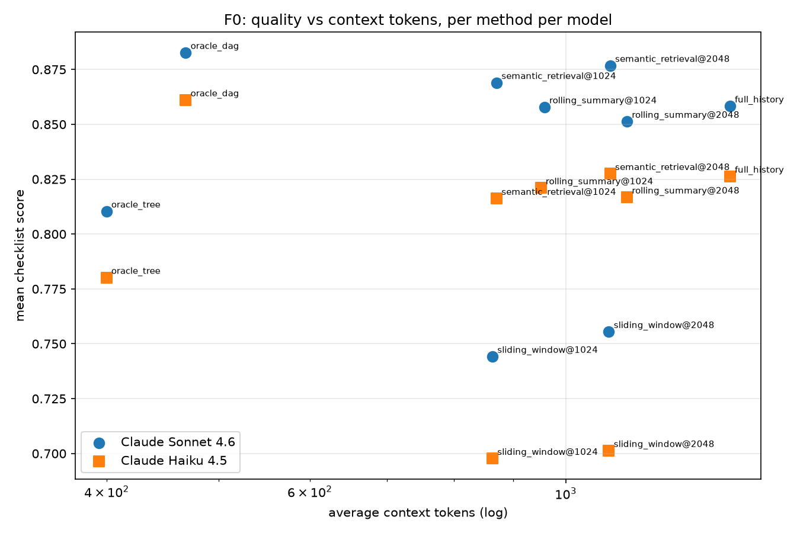

# F0 Oracle Feasibility — Results

Run date: 2026-09-13 (benchmark 1.1; the original 12-13 Sep 2026 run on benchmark 1.0 is described in `docs/results/F0_PHASE_REPORT.md`)
Manifest: `f0-oracle-feasibility/manifest.yaml` at commit `4fd32c9`
Scenario count: 145 (by family: ambiguous_reference 8, compound_turn 15, constraint_retention 12, continuation 10, join_then_split 10, knowledge_update 12, long_noisy_side_thread 10, new_root 8, resume 15, semantic_decoy 12, three_way_join 8, topic_fork 10, two_branch_join 15)
Models: Response A = Claude Sonnet 4.6 (`us.anthropic.claude-sonnet-4-6`), Response B = Claude Haiku 4.5 (`us.anthropic.claude-haiku-4-5-20251001-v1:0`), Judge = Claude Opus 4.6 (`us.anthropic.claude-opus-4-6-v1`), Embedding = `sentence-transformers/all-mpnet-base-v2` (local), Generator = Claude Sonnet 4.6 (`us.anthropic.claude-sonnet-4-6`)
Provider: Amazon Bedrock (us-east-1), tokenizer for all counts: tiktoken `cl100k_base`
Total spend for the whole study (generation + answers + summaries + judging): $72.86 across 6,308 LLM calls

## Headline result

Claude Sonnet 4.6: **GO** / Claude Haiku 4.5: **GO**, per the pre-registered thresholds in `manifest.yaml`:

- **Claude Sonnet 4.6**: oracle DAG checklist score minus full history = **+2.7 pp** (threshold: no worse than −5 pp); token reduction vs full history = **68.8%** (threshold ≥ 40%); DAG − tree on join families = **+0.315 [+0.206, +0.425]** (threshold: > 0 required). Verdict: **GO**.
- **Claude Haiku 4.5**: oracle DAG checklist score minus full history = **+2.6 pp** (threshold: no worse than −5 pp); token reduction vs full history = **68.8%** (threshold ≥ 40%); DAG − tree on join families = **+0.328 [+0.222, +0.436]** (threshold: > 0 required). Verdict: **GO**.

## Summary table

ACT = average context tokens (rendered context only; excludes system prompt and query). Token reduction is relative to full history for the same model. Checklist score = fraction of required checklist items the judge marked satisfied, with a 95% bootstrap CI over scenarios. prec/recall/F1/suff. are context-selection metrics computed from annotations; irrel. ratio is token-weighted; leakage is the judge's distractor-leakage rate.

| model | method | n | ACT | token red. % | checklist score [95% CI] | prec | recall | F1 | suff. | irrel. ratio | leakage |
|---|---|---|---|---|---|---|---|---|---|---|---|
| Claude Sonnet 4.6 | full_history | 145 | 1508 | 0.0 | 0.856 [0.82, 0.89] | 0.418 | 1.000 | 0.526 | 1.000 | 0.567 | 0.166 |
| Claude Sonnet 4.6 | oracle_dag | 145 | 471 | 68.8 | 0.883 [0.85, 0.92] | 0.954 | 1.000 | 0.966 | 1.000 | 0.039 | 0.028 |
| Claude Sonnet 4.6 | oracle_tree | 145 | 405 | 73.2 | 0.813 [0.77, 0.85] | 0.954 | 0.904 | 0.896 | 0.841 | 0.039 | 0.028 |
| Claude Sonnet 4.6 | rolling_summary@1024 | 145 | 995 | 34.0 | 0.858 [0.82, 0.89] | 0.379 | 0.698 | 0.454 | 0.593 | 0.605 | 0.152 |
| Claude Sonnet 4.6 | rolling_summary@2048 | 145 | 1237 | 18.0 | 0.846 [0.80, 0.88] | 0.401 | 0.797 | 0.493 | 0.779 | 0.585 | 0.193 |
| Claude Sonnet 4.6 | semantic_retrieval@1024 | 145 | 893 | 40.8 | 0.868 [0.83, 0.91] | 0.485 | 0.991 | 0.605 | 0.959 | 0.499 | 0.179 |
| Claude Sonnet 4.6 | semantic_retrieval@2048 | 145 | 1188 | 21.2 | 0.880 [0.84, 0.91] | 0.429 | 1.000 | 0.544 | 1.000 | 0.555 | 0.159 |
| Claude Sonnet 4.6 | sliding_window@1024 | 145 | 884 | 41.4 | 0.685 [0.63, 0.74] | 0.379 | 0.698 | 0.454 | 0.593 | 0.605 | 0.248 |
| Claude Sonnet 4.6 | sliding_window@2048 | 145 | 1184 | 21.5 | 0.728 [0.67, 0.78] | 0.401 | 0.797 | 0.493 | 0.779 | 0.585 | 0.234 |
| Claude Haiku 4.5 | full_history | 145 | 1508 | 0.0 | 0.820 [0.78, 0.86] | 0.418 | 1.000 | 0.526 | 1.000 | 0.567 | 0.186 |
| Claude Haiku 4.5 | oracle_dag | 145 | 471 | 68.8 | 0.846 [0.81, 0.88] | 0.954 | 1.000 | 0.966 | 1.000 | 0.039 | 0.021 |
| Claude Haiku 4.5 | oracle_tree | 145 | 405 | 73.2 | 0.768 [0.72, 0.81] | 0.954 | 0.904 | 0.896 | 0.841 | 0.039 | 0.021 |
| Claude Haiku 4.5 | rolling_summary@1024 | 145 | 988 | 34.5 | 0.822 [0.78, 0.86] | 0.379 | 0.698 | 0.454 | 0.593 | 0.605 | 0.200 |
| Claude Haiku 4.5 | rolling_summary@2048 | 145 | 1235 | 18.1 | 0.820 [0.78, 0.86] | 0.401 | 0.797 | 0.493 | 0.779 | 0.585 | 0.214 |
| Claude Haiku 4.5 | semantic_retrieval@1024 | 145 | 893 | 40.8 | 0.814 [0.77, 0.86] | 0.485 | 0.991 | 0.605 | 0.959 | 0.499 | 0.145 |
| Claude Haiku 4.5 | semantic_retrieval@2048 | 145 | 1188 | 21.2 | 0.828 [0.79, 0.87] | 0.429 | 1.000 | 0.544 | 1.000 | 0.555 | 0.166 |
| Claude Haiku 4.5 | sliding_window@1024 | 145 | 884 | 41.4 | 0.635 [0.58, 0.69] | 0.379 | 0.698 | 0.454 | 0.593 | 0.605 | 0.234 |
| Claude Haiku 4.5 | sliding_window@2048 | 145 | 1184 | 21.5 | 0.677 [0.62, 0.74] | 0.401 | 0.797 | 0.493 | 0.779 | 0.585 | 0.262 |

## Pareto frontier

`results/plots/pareto.png`: x = average context tokens (log), y = mean checklist score, one point per method per model.

## Mandatory pairwise comparisons

Paired bootstrap over scenarios (10,000 resamples), oracle DAG minus baseline, per response model.

Quality (checklist score):

| model | baseline | n | diff [95% CI] |
|---|---|---|---|
| Claude Sonnet 4.6 | full_history | 145 | +0.026 [-0.007, +0.061] |
| Claude Sonnet 4.6 | sliding_window@1024 | 145 | +0.198 [+0.138, +0.258] |
| Claude Sonnet 4.6 | sliding_window@2048 | 145 | +0.154 [+0.097, +0.213] |
| Claude Sonnet 4.6 | rolling_summary@1024 | 145 | +0.025 [-0.010, +0.061] |
| Claude Sonnet 4.6 | rolling_summary@2048 | 145 | +0.037 [+0.002, +0.072] |
| Claude Sonnet 4.6 | semantic_retrieval@1024 | 145 | +0.014 [-0.018, +0.047] |
| Claude Sonnet 4.6 | semantic_retrieval@2048 | 145 | +0.003 [-0.029, +0.036] |
| Claude Haiku 4.5 | full_history | 145 | +0.026 [-0.014, +0.068] |
| Claude Haiku 4.5 | sliding_window@1024 | 145 | +0.212 [+0.149, +0.275] |
| Claude Haiku 4.5 | sliding_window@2048 | 145 | +0.169 [+0.110, +0.233] |
| Claude Haiku 4.5 | rolling_summary@1024 | 145 | +0.024 [-0.018, +0.067] |
| Claude Haiku 4.5 | rolling_summary@2048 | 145 | +0.027 [-0.013, +0.067] |
| Claude Haiku 4.5 | semantic_retrieval@1024 | 145 | +0.032 [-0.009, +0.075] |
| Claude Haiku 4.5 | semantic_retrieval@2048 | 145 | +0.018 [-0.021, +0.058] |

Context tokens:

| model | baseline | n | diff [95% CI] |
|---|---|---|---|
| Claude Sonnet 4.6 | full_history | 145 | -1036.848 [-1256.795, -834.198] |
| Claude Sonnet 4.6 | sliding_window@1024 | 145 | -413.379 [-454.986, -373.191] |
| Claude Sonnet 4.6 | sliding_window@2048 | 145 | -712.621 [-811.257, -620.129] |
| Claude Sonnet 4.6 | rolling_summary@1024 | 145 | -524.310 [-576.132, -471.979] |
| Claude Sonnet 4.6 | rolling_summary@2048 | 145 | -766.062 [-880.167, -656.970] |
| Claude Sonnet 4.6 | semantic_retrieval@1024 | 145 | -422.297 [-462.766, -380.510] |
| Claude Sonnet 4.6 | semantic_retrieval@2048 | 145 | -716.972 [-817.001, -622.703] |
| Claude Haiku 4.5 | full_history | 145 | -1036.848 [-1261.893, -831.675] |
| Claude Haiku 4.5 | sliding_window@1024 | 145 | -413.379 [-454.848, -372.937] |
| Claude Haiku 4.5 | sliding_window@2048 | 145 | -712.621 [-808.711, -619.618] |
| Claude Haiku 4.5 | rolling_summary@1024 | 145 | -516.710 [-569.126, -464.041] |
| Claude Haiku 4.5 | rolling_summary@2048 | 145 | -763.655 [-874.312, -654.620] |
| Claude Haiku 4.5 | semantic_retrieval@1024 | 145 | -422.297 [-463.642, -380.813] |
| Claude Haiku 4.5 | semantic_retrieval@2048 | 145 | -716.972 [-814.201, -621.392] |

## Join-specific result (oracle DAG vs. oracle tree, join families only)

Families: two_branch_join, three_way_join, join_then_split. Checklist score, oracle DAG minus oracle tree:

| model | n | diff [95% CI] | families |
|---|---|---|---|
| Claude Sonnet 4.6 | 33 | +0.315 [+0.206, +0.425] | two_branch_join,three_way_join,join_then_split |
| Claude Haiku 4.5 | 33 | +0.328 [+0.222, +0.436] | two_branch_join,three_way_join,join_then_split |

## By-family breakdown

Checklist score by family, Claude Sonnet 4.6:

| family | full_history | oracle_dag | oracle_tree | rolling_summary@1024 | rolling_summary@2048 | semantic_retrieval@1024 | semantic_retrieval@2048 | sliding_window@1024 | sliding_window@2048 |
|---|---|---|---|---|---|---|---|---|---|
| ambiguous_reference | 0.64 | 0.79 | 0.79 | 0.68 | 0.64 | 0.64 | 0.64 | 0.64 | 0.64 |
| compound_turn | 0.78 | 0.77 | 0.75 | 0.79 | 0.74 | 0.82 | 0.78 | 0.78 | 0.73 |
| constraint_retention | 0.89 | 0.97 | 0.97 | 0.92 | 0.86 | 0.97 | 1.00 | 0.38 | 0.42 |
| continuation | 0.82 | 0.82 | 0.82 | 0.85 | 0.85 | 0.78 | 0.82 | 0.82 | 0.82 |
| join_then_split | 0.90 | 0.92 | 0.89 | 0.92 | 0.82 | 0.92 | 0.88 | 0.82 | 0.85 |
| knowledge_update | 1.00 | 1.00 | 1.00 | 0.98 | 0.96 | 1.00 | 1.00 | 0.22 | 0.62 |
| long_noisy_side_thread | 0.94 | 0.98 | 0.95 | 0.88 | 0.94 | 0.92 | 0.94 | 0.31 | 0.21 |
| new_root | 0.80 | 0.92 | 0.92 | 0.82 | 0.77 | 0.81 | 0.88 | 0.77 | 0.77 |
| resume | 0.91 | 0.87 | 0.87 | 0.91 | 0.95 | 0.95 | 0.91 | 0.82 | 0.91 |
| semantic_decoy | 0.90 | 0.85 | 0.92 | 0.85 | 0.90 | 0.85 | 0.94 | 0.92 | 0.85 |
| three_way_join | 0.62 | 0.69 | 0.44 | 0.69 | 0.59 | 0.62 | 0.66 | 0.59 | 0.72 |
| topic_fork | 0.78 | 0.90 | 0.90 | 0.80 | 0.85 | 0.80 | 0.88 | 0.78 | 0.85 |
| two_branch_join | 0.97 | 0.95 | 0.41 | 0.92 | 0.94 | 0.98 | 0.97 | 0.92 | 0.92 |

Checklist score by family, Claude Haiku 4.5:

| family | full_history | oracle_dag | oracle_tree | rolling_summary@1024 | rolling_summary@2048 | semantic_retrieval@1024 | semantic_retrieval@2048 | sliding_window@1024 | sliding_window@2048 |
|---|---|---|---|---|---|---|---|---|---|
| ambiguous_reference | 0.64 | 0.83 | 0.83 | 0.64 | 0.64 | 0.64 | 0.64 | 0.64 | 0.64 |
| compound_turn | 0.75 | 0.68 | 0.68 | 0.78 | 0.78 | 0.69 | 0.77 | 0.80 | 0.77 |
| constraint_retention | 0.94 | 0.86 | 0.82 | 0.82 | 0.89 | 0.92 | 0.97 | 0.19 | 0.19 |
| continuation | 0.90 | 0.90 | 0.90 | 0.90 | 0.90 | 0.85 | 0.90 | 0.85 | 0.90 |
| join_then_split | 0.82 | 0.87 | 0.90 | 0.82 | 0.82 | 0.84 | 0.82 | 0.82 | 0.82 |
| knowledge_update | 0.92 | 0.94 | 0.94 | 0.98 | 0.98 | 1.00 | 1.00 | 0.19 | 0.65 |
| long_noisy_side_thread | 0.90 | 0.83 | 0.83 | 0.88 | 0.87 | 0.92 | 0.92 | 0.15 | 0.13 |
| new_root | 0.35 | 0.88 | 0.88 | 0.38 | 0.35 | 0.35 | 0.35 | 0.35 | 0.35 |
| resume | 0.91 | 0.86 | 0.86 | 0.87 | 0.91 | 0.88 | 0.88 | 0.78 | 0.86 |
| semantic_decoy | 0.81 | 0.83 | 0.83 | 0.83 | 0.81 | 0.81 | 0.81 | 0.83 | 0.81 |
| three_way_join | 0.88 | 0.88 | 0.38 | 0.88 | 0.88 | 0.88 | 0.88 | 0.84 | 0.88 |
| topic_fork | 0.78 | 0.82 | 0.82 | 0.88 | 0.78 | 0.78 | 0.78 | 0.80 | 0.78 |
| two_branch_join | 0.88 | 0.88 | 0.40 | 0.87 | 0.86 | 0.85 | 0.86 | 0.87 | 0.86 |

Context recall by family (identical for both models; selection does not depend on the response model):

| family | full_history | oracle_dag | oracle_tree | rolling_summary@1024 | rolling_summary@2048 | semantic_retrieval@1024 | semantic_retrieval@2048 | sliding_window@1024 | sliding_window@2048 |
|---|---|---|---|---|---|---|---|---|---|
| ambiguous_reference | 1.00 | 1.00 | 1.00 | 1.00 | 1.00 | 1.00 | 1.00 | 1.00 | 1.00 |
| compound_turn | 1.00 | 1.00 | 1.00 | 0.98 | 1.00 | 1.00 | 1.00 | 0.98 | 1.00 |
| constraint_retention | 1.00 | 1.00 | 1.00 | 0.00 | 0.04 | 0.96 | 1.00 | 0.00 | 0.04 |
| continuation | 1.00 | 1.00 | 1.00 | 0.99 | 1.00 | 0.99 | 1.00 | 0.99 | 1.00 |
| join_then_split | 1.00 | 1.00 | 1.00 | 1.00 | 1.00 | 1.00 | 1.00 | 1.00 | 1.00 |
| knowledge_update | 1.00 | 1.00 | 1.00 | 0.00 | 0.33 | 1.00 | 1.00 | 0.00 | 0.33 |
| long_noisy_side_thread | 1.00 | 1.00 | 1.00 | 0.00 | 0.00 | 1.00 | 1.00 | 0.00 | 0.00 |
| new_root | 1.00 | 1.00 | 1.00 | 1.00 | 1.00 | 1.00 | 1.00 | 1.00 | 1.00 |
| resume | 1.00 | 1.00 | 1.00 | 0.73 | 1.00 | 1.00 | 1.00 | 0.73 | 1.00 |
| semantic_decoy | 1.00 | 1.00 | 1.00 | 0.81 | 1.00 | 1.00 | 1.00 | 0.81 | 1.00 |
| three_way_join | 1.00 | 1.00 | 0.30 | 0.96 | 1.00 | 0.97 | 1.00 | 0.96 | 1.00 |
| topic_fork | 1.00 | 1.00 | 1.00 | 0.78 | 1.00 | 0.96 | 1.00 | 0.78 | 1.00 |
| two_branch_join | 1.00 | 1.00 | 0.45 | 0.97 | 1.00 | 1.00 | 1.00 | 0.97 | 1.00 |

## Failure cases

Oracle-DAG context-insufficiency cases: **0** (expected 0 by construction). Instances (scenario × model) where full history scored at or above oracle DAG while oracle DAG was below 1.0: **83** of 290, of which 47 are ties and 36 are strict full-history wins. They are spread across families (see table) rather than concentrated, consistent with judge/checklist noise; the paired bootstrap above already accounts for them.

| type | scenario_id | model | note |
|---|---|---|---|
| full_history_ge_oracle_dag | ambiguous_reference_001 | response_a | full=1.00 dag=0.67 |
| full_history_ge_oracle_dag | ambiguous_reference_002 | response_a | full=0.33 dag=0.33 |
| full_history_ge_oracle_dag | compound_turn_001 | response_a | full=0.75 dag=0.25 |
| full_history_ge_oracle_dag | compound_turn_004 | response_a | full=1.00 dag=0.67 |
| full_history_ge_oracle_dag | compound_turn_005 | response_a | full=0.67 dag=0.33 |
| full_history_ge_oracle_dag | compound_turn_007 | response_a | full=1.00 dag=0.75 |
| full_history_ge_oracle_dag | compound_turn_009 | response_a | full=0.75 dag=0.50 |
| full_history_ge_oracle_dag | continuation_002 | response_a | full=0.25 dag=0.25 |
| full_history_ge_oracle_dag | continuation_005 | response_a | full=0.50 dag=0.50 |
| full_history_ge_oracle_dag | continuation_010 | response_a | full=0.50 dag=0.50 |
| full_history_ge_oracle_dag | join_then_split_002 | response_a | full=0.75 dag=0.50 |
| full_history_ge_oracle_dag | join_then_split_007 | response_a | full=1.00 dag=0.67 |
| full_history_ge_oracle_dag | long_noisy_side_thread_006 | response_a | full=1.00 dag=0.75 |
| full_history_ge_oracle_dag | new_root_001 | response_a | full=1.00 dag=0.67 |
| full_history_ge_oracle_dag | new_root_006 | response_a | full=0.67 dag=0.67 |
| full_history_ge_oracle_dag | resume_001 | response_a | full=0.75 dag=0.75 |
| full_history_ge_oracle_dag | resume_003 | response_a | full=0.67 dag=0.67 |
| full_history_ge_oracle_dag | resume_005 | response_a | full=1.00 dag=0.33 |
| full_history_ge_oracle_dag | resume_006 | response_a | full=1.00 dag=0.75 |
| full_history_ge_oracle_dag | resume_013 | response_a | full=0.75 dag=0.75 |
| full_history_ge_oracle_dag | resume_015 | response_a | full=0.75 dag=0.75 |
| full_history_ge_oracle_dag | semantic_decoy_001 | response_a | full=1.00 dag=0.25 |
| full_history_ge_oracle_dag | semantic_decoy_005 | response_a | full=1.00 dag=0.75 |
| full_history_ge_oracle_dag | semantic_decoy_006 | response_a | full=0.75 dag=0.75 |
| full_history_ge_oracle_dag | semantic_decoy_012 | response_a | full=1.00 dag=0.75 |
| full_history_ge_oracle_dag | three_way_join_002 | response_a | full=1.00 dag=0.75 |
| full_history_ge_oracle_dag | three_way_join_003 | response_a | full=0.25 dag=0.25 |
| full_history_ge_oracle_dag | three_way_join_004 | response_a | full=0.25 dag=0.25 |
| full_history_ge_oracle_dag | three_way_join_008 | response_a | full=0.25 dag=0.25 |
| full_history_ge_oracle_dag | topic_fork_002 | response_a | full=0.75 dag=0.75 |
| full_history_ge_oracle_dag | topic_fork_004 | response_a | full=0.50 dag=0.50 |
| full_history_ge_oracle_dag | topic_fork_007 | response_a | full=0.75 dag=0.75 |
| full_history_ge_oracle_dag | two_branch_join_007 | response_a | full=1.00 dag=0.75 |
| full_history_ge_oracle_dag | two_branch_join_011 | response_a | full=0.75 dag=0.75 |
| full_history_ge_oracle_dag | two_branch_join_014 | response_a | full=0.75 dag=0.75 |
| full_history_ge_oracle_dag | ambiguous_reference_002 | response_b | full=0.33 dag=0.33 |
| full_history_ge_oracle_dag | compound_turn_002 | response_b | full=0.50 dag=0.50 |
| full_history_ge_oracle_dag | compound_turn_004 | response_b | full=1.00 dag=0.67 |
| full_history_ge_oracle_dag | compound_turn_006 | response_b | full=1.00 dag=0.33 |
| full_history_ge_oracle_dag | compound_turn_007 | response_b | full=0.50 dag=0.50 |
| full_history_ge_oracle_dag | constraint_retention_003 | response_b | full=1.00 dag=0.67 |
| full_history_ge_oracle_dag | constraint_retention_007 | response_b | full=0.67 dag=0.67 |
| full_history_ge_oracle_dag | constraint_retention_010 | response_b | full=1.00 dag=0.67 |
| full_history_ge_oracle_dag | constraint_retention_011 | response_b | full=1.00 dag=0.67 |
| full_history_ge_oracle_dag | constraint_retention_012 | response_b | full=0.67 dag=0.67 |
| full_history_ge_oracle_dag | continuation_007 | response_b | full=0.50 dag=0.50 |
| full_history_ge_oracle_dag | continuation_010 | response_b | full=0.50 dag=0.50 |
| full_history_ge_oracle_dag | join_then_split_002 | response_b | full=0.50 dag=0.50 |
| full_history_ge_oracle_dag | join_then_split_003 | response_b | full=1.00 dag=0.75 |
| full_history_ge_oracle_dag | join_then_split_006 | response_b | full=1.00 dag=0.75 |
| full_history_ge_oracle_dag | join_then_split_007 | response_b | full=0.67 dag=0.67 |
| full_history_ge_oracle_dag | long_noisy_side_thread_001 | response_b | full=0.75 dag=0.75 |
| full_history_ge_oracle_dag | long_noisy_side_thread_003 | response_b | full=0.75 dag=0.75 |
| full_history_ge_oracle_dag | long_noisy_side_thread_006 | response_b | full=0.75 dag=0.75 |
| full_history_ge_oracle_dag | long_noisy_side_thread_009 | response_b | full=1.00 dag=0.75 |
| full_history_ge_oracle_dag | long_noisy_side_thread_010 | response_b | full=1.00 dag=0.33 |
| full_history_ge_oracle_dag | new_root_007 | response_b | full=0.67 dag=0.67 |
| full_history_ge_oracle_dag | resume_001 | response_b | full=0.75 dag=0.75 |
| full_history_ge_oracle_dag | resume_003 | response_b | full=1.00 dag=0.67 |
| full_history_ge_oracle_dag | resume_006 | response_b | full=0.75 dag=0.75 |
| full_history_ge_oracle_dag | resume_007 | response_b | full=0.33 dag=0.33 |
| full_history_ge_oracle_dag | resume_014 | response_b | full=1.00 dag=0.33 |
| full_history_ge_oracle_dag | semantic_decoy_001 | response_b | full=0.50 dag=0.50 |
| full_history_ge_oracle_dag | semantic_decoy_005 | response_b | full=0.75 dag=0.75 |
| full_history_ge_oracle_dag | semantic_decoy_006 | response_b | full=0.75 dag=0.75 |
| full_history_ge_oracle_dag | semantic_decoy_007 | response_b | full=0.67 dag=0.67 |
| full_history_ge_oracle_dag | semantic_decoy_010 | response_b | full=1.00 dag=0.50 |
| full_history_ge_oracle_dag | three_way_join_003 | response_b | full=0.25 dag=0.25 |
| full_history_ge_oracle_dag | three_way_join_005 | response_b | full=1.00 dag=0.75 |
| full_history_ge_oracle_dag | topic_fork_005 | response_b | full=0.50 dag=0.50 |
| full_history_ge_oracle_dag | topic_fork_006 | response_b | full=1.00 dag=0.75 |
| full_history_ge_oracle_dag | topic_fork_007 | response_b | full=0.75 dag=0.75 |
| full_history_ge_oracle_dag | topic_fork_009 | response_b | full=1.00 dag=0.75 |
| full_history_ge_oracle_dag | two_branch_join_002 | response_b | full=0.67 dag=0.67 |
| full_history_ge_oracle_dag | two_branch_join_004 | response_b | full=0.75 dag=0.50 |
| full_history_ge_oracle_dag | two_branch_join_011 | response_b | full=0.75 dag=0.75 |
| full_history_ge_oracle_dag | two_branch_join_014 | response_b | full=0.75 dag=0.75 |
| full_history_ge_oracle_dag | two_branch_join_015 | response_b | full=1.00 dag=0.67 |
| full_history_ge_oracle_dag | compound_turn_011 | response_b | full=0.75 dag=0.75 |
| full_history_ge_oracle_dag | compound_turn_012 | response_b | full=0.75 dag=0.75 |
| full_history_ge_oracle_dag | compound_turn_013 | response_b | full=0.25 dag=0.25 |
| full_history_ge_oracle_dag | compound_turn_015 | response_b | full=0.75 dag=0.25 |
| full_history_ge_oracle_dag | knowledge_update_011 | response_b | full=1.00 dag=0.33 |

Full per-instance data: `results/tables/per_instance.csv`; raw prompts/responses: `results/raw/answers.jsonl`; judge outputs: `results/scored/scores.jsonl`.

## Limitations of this run

- **Model coverage.** No open-weight model was reachable in this environment; Claude Haiku 4.5 stands in as the weaker response model. Both response models and the judge are from one vendor family.
- **Judge overlap.** The judge (Opus 4.6) is distinct from both response models, but shares a vendor and training lineage with them; self-preference bias is reduced, not eliminated.
- **Judge routing and prompt fallback.** Bedrock's per-region daily token quota for Opus 4.6 forced the judge calls to be spread across the model's regional (`us.`) and global inference profiles and several AWS regions; it is the same model throughout, and every score record names the profile used (us.anthropic.claude-opus-4-6-v1: 1310, global.anthropic.claude-opus-4-6-v1: 1300). In 25 of 2610 judge calls (1.0%) the primary judge prompt returned prose (the model continued the conversation instead of scoring it); those were re-judged with the same rubric wrapped in a system prompt and delimiters, and are flagged `judge_prompt_variant: fallback`.
- **Checklist artifact on oracle contexts.** Some checklist items reward explicit disambiguation (e.g. "resolves *there* to Ridgeline, not Saltmarsh"). With oracle context the decoy entity is absent, so the model has no reason to name it and can lose the item despite answering correctly. This penalizes the oracle methods, not the baselines, so it makes the reported oracle-vs-baseline quality differences conservative.
- **NTM not included.** No verifiable public release of the Context-Agent NTM benchmark was found; the custom synthetic benchmark is the only data.
- **Synthetic data.** Scenarios were LLM-drafted against code-decided gold graphs and mechanically validated; every tenth scenario was hand-read. Structure is exact by construction, but naturalness and distractor irrelevance are only spot-checked.
- **Budgets.** The windowed baselines used token budgets of [1024, 2048] (the handoff's default was [2048, 4096]); changed before the full run because the pilot showed 4096 would coincide with full history on most scenarios. See the note in `manifest.yaml`.
- **Tokenizer.** `cl100k_base` is an approximation for Claude models; all methods are counted identically, so relative comparisons hold but absolute counts are not what Bedrock bills.
- **Temperature.** All response and judge calls used temperature 0; the generator used 0.7–0.9.

## Recommendation

- Claude Sonnet 4.6: GO
- Claude Haiku 4.5: GO

Per the handoff's decision procedure: GO means proceed to F0.5 (candidate-realism check), not to an automatic router. PIVOT names the specific change (tree-only, or revised dependency semantics). STOP means report the result as a finding and do not proceed. The verdicts above are the mechanical output of the thresholds, not a new judgment call.
